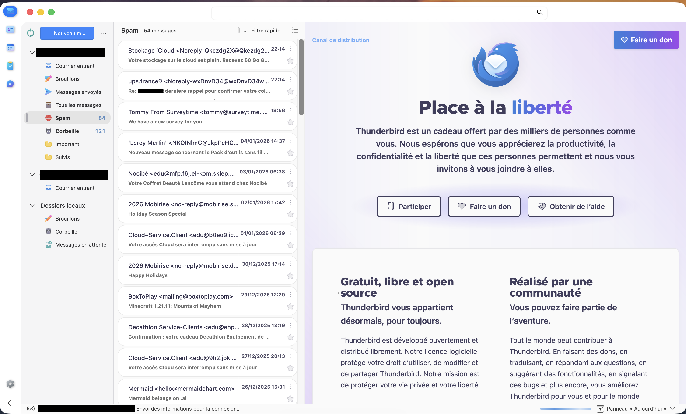

# Thunderbird-Fluent - Un thème Fluent Design pour Thunderbird


Un thème élégant et moderne basé sur le travail de [FluentBird](https://github.com/Deathbyteacup/fluentbird) de [Deathbyteacup
](https://github.com/Deathbyteacup) pour Thunderbird, offrant une expérience utilisateur raffinée avec des animations fluides et une interface épurée.

## ✨ Fonctionnalités

### 🎨 Design Moderne
- **Arrondis fluides** sur tous les éléments d'interface
- **Effets d'ombres** subtils et profondeur
- **Thème clair/sombre** avec détection automatique
- **Bordures arrondies** cohérentes (8-16px)
- **Transitions fluides** entre les états

### 🖱️ Animations et Interactions
- **Animation de rotation** de l'icône Paramètres au survol
- **Effets de survol** sur tous les boutons et éléments interactifs
- **Animations de sélection** des onglets et messages
- **Animation de synchronisation** de l'icône de rafraîchissement
- **Transformations subtiles** (élévation, scaling)

### 🎯 Améliorations d'Interface
- **Onglets redessinés** avec des bordures arrondies et séparation claire
- **Cartes de messages** avec design moderne et espacement amélioré
- **Sidebar revue** avec des icônes colorées et effets de survol
- **Barre de recherche** compacte et élégante
- **Boutons d'action** avec icônes personnalisées
- **Adaptation macOS** avec des arrondis plus prononcés

### 🎨 Personnalisation Visuelle
- **Icônes personnalisées** pour tous les boutons et dossiers
- **Couleurs cohérentes** avec le design Fluent
- **Contraste optimisé** pour une meilleure lisibilité
- **Effets de transparence** subtils
- **Support du Mica** pour Windows 11

## 🖼️ Aperçu



## 📦 Installation

### Étape 1 : Activer userChrome.css

1. Ouvrez **Thunderbird**
2. Allez dans **Paramètres** > **Général**
3. Cliquez sur **Éditeur de configuration…** sous la section *Avancé*
4. Recherchez `toolkit.legacyUserProfileCustomisations.stylesheets`
5. Définissez cette valeur sur **true**
6. Redémarrez Thunderbird

### Étape 2 : Activer les drapeaux Mica (Optionnel - Windows)

Pour obtenir l'effet Mica sur Windows 11 :

1. Ouvrez **Thunderbird**
2. Allez dans **Paramètres** > **Général**
3. Cliquez sur **Éditeur de configuration…** sous la section *Avancé*
4. Dans la barre de recherche, tapez `widget.windows.mica` et définissez sur **true**
5. Recherchez `widget.windows.mica.popups` et définissez sur **2**

### Étape 3 : Désactiver les autres thèmes

Assurez-vous qu'aucun autre thème n'est sélectionné dans les paramètres de Thunderbird. Ne sélectionnez **pas** Clair, Sombre, ou aucun thème du magasin d'extensions Thunderbird. Le thème doit être réglé sur **"Thème système"** ou simplement non sélectionné.

### Étape 4 : Copier les fichiers

1. Cliquez sur **Aide** > **Informations de dépannage**
2. Faites défiler jusqu'à **"Dossier de profil"** sous **"Bases de l'application"** et cliquez sur **"Ouvrir le dossier"**
3. Créez un nouveau dossier nommé **chrome** dans votre dossier de profil, s'il n'existe pas déjà
4. Placez le fichier `userChrome.css` et le dossier `Icons` dans le répertoire `chrome`
5. **Important** : Pour les utilisateurs Windows, copiez également le dossier `Titlebar_Icons`

```
Votre dossier de profil/
└── chrome/
    ├── userChrome.css
    ├── Icons/ (tous les fichiers SVG d'icônes)
    └── Titlebar_Icons/
```

### Étape 5 : Redémarrer Thunderbird

Redémarrez Thunderbird pour appliquer le thème. Si les modifications ne s'appliquent pas immédiatement, essayez de redémarrer complètement Thunderbird.

## 🐛 Dépannage

### Le thème ne s'applique pas ?
- Vérifiez que `toolkit.legacyUserProfileCustomisations.stylesheets` est sur **true**
- Assurez-vous que les fichiers sont dans le bon dossier `chrome`
- Vérifiez qu'il n'y a pas de thème externe activé
- Essayez de redémarrer Thunderbird complètement

### Les icônes n'apparaissent pas ?
- Vérifiez que le dossier `Icons` contient tous les fichiers SVG
- Assurez-vous que les chemins dans le CSS sont corrects
- Pour les utilisateurs Windows, vérifiez la présence du dossier `Titlebar_Icons`

### Problèmes spécifiques à macOS ?
- Le thème est optimisé pour macOS avec des arrondis plus prononcés
- Si vous rencontrez des problèmes d'affichage, vérifiez que vous utilisez la dernière version de Thunderbird

## 🛠️ Personnalisation

Vous pouvez facilement personnaliser ce thème en modifiant le fichier `userChrome.css` :

### Changer les couleurs
```css
/* Exemple : Changer la couleur principale */
.toolbarbutton-1:hover {
    background-color: VOTRE_COULEUR !important;
}
```

### Modifier les animations
```css
/* Exemple : Ralentir l'animation de rotation */
@keyframes rotateSettings {
    0% {
        transform: translateY(-2px) rotate(0deg);
    }
    100% {
        transform: translateY(-2px) rotate(360deg);
    }
}

#settingsButton:hover {
    animation: rotateSettings 1s linear !important; /* Changé de 0.6s à 1s */
}
```

### Ajouter vos propres icônes
Remplacez simplement les fichiers SVG dans le dossier `Icons` par vos propres icônes, en conservant les mêmes noms de fichiers.

## 🤝 Contribution

Les contributions sont les bienvenues ! Si vous avez des suggestions d'améliorations, des corrections de bugs ou des nouvelles fonctionnalités :

1. Forkez le projet
2. Créez une branche pour votre fonctionnalité (`git checkout -b feature/AmazingFeature`)
3. Committez vos changements (`git commit -m 'Add some AmazingFeature'`)
4. Pushez vers la branche (`git push origin feature/AmazingFeature`)
5. Ouvrez une Pull Request

## 🙏 Remerciements

Un énorme merci à :
- **[Deathbyteacup](https://github.com/Deathbyteacup)** pour son travail original sur FluentBird ❤️❤️❤️

## 📄 Licence

Ce projet est distribué sous la licence MIT. Voir le fichier `LICENSE` pour plus d'informations.

## ⭐ Support

Si vous aimez ce thème, n'hésitez pas à :
- Donner une ⭐ sur GitHub
- Partager avec d'autres utilisateurs de Thunderbird
- Signaler les bugs ou suggérer des améliorations
